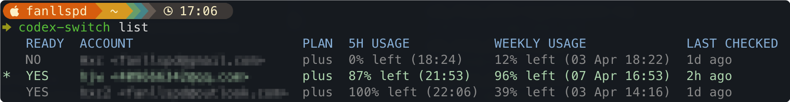

# codex-switch

Go CLI for saving, switching, refreshing, and inspecting local Codex ChatGPT login sessions.



## Build

```bash
make build
./bin/codex-switch -h
```

## Common commands

```bash
./bin/codex-switch login
./bin/codex-switch login work --force
./bin/codex-switch save work
./bin/codex-switch use work
./bin/codex-switch list
./bin/codex-switch current
./bin/codex-switch sync --all
./bin/codex-switch token-info
./bin/codex-switch doctor
```

## Shell completion

Install zsh completion for the current user:

```bash
./bin/codex-switch install-completion zsh
```

If your `~/.zshrc` does not already configure completions:

```bash
echo 'fpath=(~/.zsh/completions $fpath)' >> ~/.zshrc
echo 'autoload -U compinit && compinit' >> ~/.zshrc
source ~/.zshrc
```

## Config

Config file path:

```text
~/.codex/codex-switch.json
```

The tool auto-creates this file on first run. Refresh uses the `client_id` inferred from the current local login token when available, and falls back to `network.refreshClientID` only if inference is unavailable.
